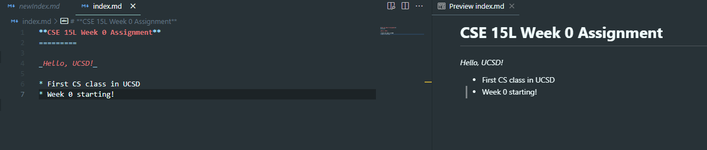

# __Week 0 Lab__

## Jae Hyun Cha

[Link](https://github.com/Jae-Hyun-Cha/cse15l-lab-reports)

[Lab Report 1](https://Jae-Hyun-Cha.github.io/cse15l-lab-reports/lab-report-1-week-0.html)

* List
* List
* List

1. One
2. Two
3. Three

Horizontal rule:

---

> Blockquote

_Hello, world!_



`Inline code` with backticks

```
# code block
print '3 backticks or'
print 'indent 4 spaces'
```
