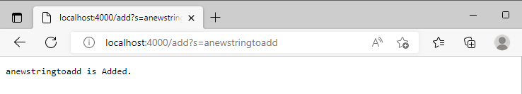
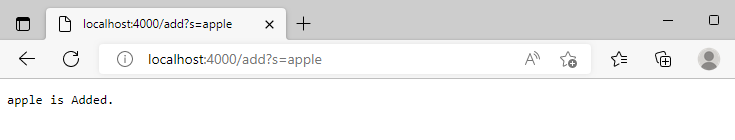
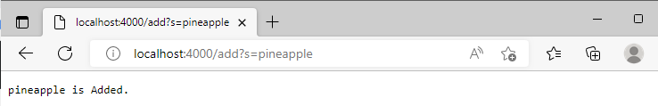
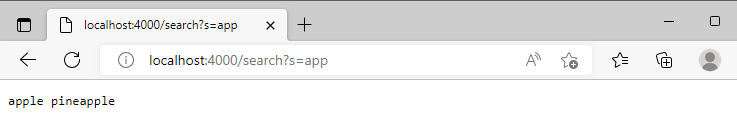
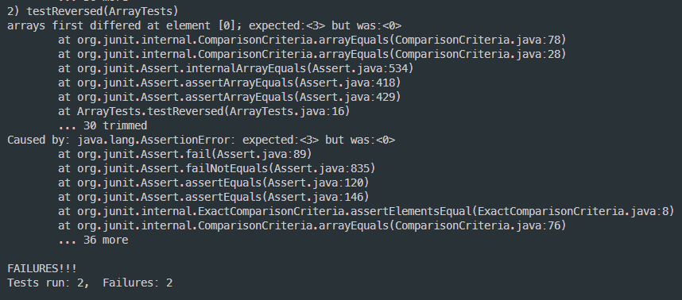
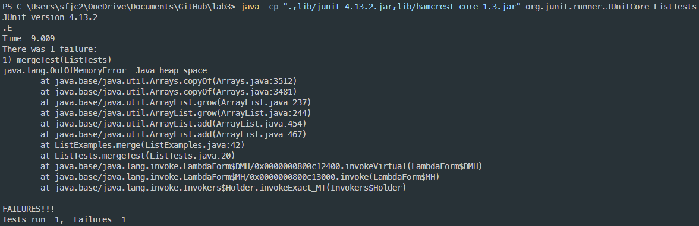

# Lab Report 2 (Week 3)

# _Part1 : Search Engine_

## Code

```
import java.io.IOException;
import java.net.URI;
import java.util.ArrayList;

class Handler implements URLHandler {
    // The one bit of state on the server: a number that will be manipulated by
    // various requests.
    ArrayList<String> SearchList = new ArrayList<String>();

    public String handleRequest(URI url) {
        if (url.getPath().equals("/")) {
            return String.format("");
        } else if (url.getPath().equals("/add")) {
            String[] parameters = url.getQuery().split("=");
            if (parameters[0].equals("s")){
                SearchList.add(parameters[1]);
                return String.format(parameters[1] + " is Added.");
            }
        } else {
            System.out.println("Path: " + url.getPath());
            if (url.getPath().contains("/search")) {
                String Searched = "";
                String[] parameters = url.getQuery().split("=");
                for(int i = 0; i < SearchList.size(); i += 1){ 
                    if (SearchList.get(i).contains(parameters[1])){ 
                        Searched = Searched + SearchList.get(i) + " ";
                    }
                }
                return Searched;
            }
        }
    return "404 Not Found!";
    }
}

class SearchEngine {
    public static void main(String[] args) throws IOException {
        if(args.length == 0){
            System.out.println("Missing port number! Try any number between 1024 to 49151");
            return;
        }

        int port = Integer.parseInt(args[0]);

        Server.start(port, new Handler());
    }
}
```
   - By using .getPath( ), .equals, .contains, etc... the path is being checked and accessed.
   - First, the method will check the path _“/”_ and if it is recognized it will execute the _if_ statement.
   - Next, the method will check the path _"/add"_ and if it is recognized it will execute the _else if_ statement.
   - Lastly, inside the _else_ statement, if the method recognizes _"/search"_ then it will execute the _if_ statement inside the _else_ statement.

## Relevant arguments and fields of the class

- Printing the URL path, relevant arguments include "=" and "s" which are provided in URL path when using "add" or "search".
- Relevants fields of class are the path containing "/" , "/add" or "/search" as these execute what our program should display.

## Values Change


- In these three Screenshot, the method "handleRequest" is called and it takes _"URL"_ as a parameter.
- The method has recognized the path _"/add"_ and it will execute the _else if_ statement.  
- Like the screenshots above, the _String_ value "anewstringtoadd", “apple”, and “pineapple” gets added to the _String_ ArrayList called "SearchList" which I made inside the class. 




- Since the "/search" the path, the method will recognize it and execute the _if_ statement inside the _else_ statement. 
- Right now, inside the ArrayList "SearchList", three String values are added. "anewstringtoadd" at index 0, "apple" at index 1, and "apple" at index 2.
- The method will search what is after "_=_" which is "app". Empty string is created to add the result. After that using the _for loop_. it will check each String value in the ArrayList "SearchList". If it recognizes that the String value has "app", it will append the String value into a single string and print it out.
- Since "apple" and "pineapple" are the String value that contains "app", "apple pineapple" will be printed.

# _Part2 : Debug_

## 1. reversed
```
  static int[] reversed(int[] arr) {
    int[] newArray = new int[arr.length];
    for(int i = 0; i < arr.length; i += 1) {
      arr[i] = newArray[arr.length - i - 1];
    }
    return arr;
  }
``` 

- The failure-inducing input (the code of the test)
```
  @Test
  public void testReversed() {
    int[] input1 = {1,2,3};
    assertArrayEquals(new int[]{3,2,1}, ArrayExamples.reversed(input1));
  }
```
- The symptom (the failing test output)


- The bug (the code fix needed)
```
    for(int i = 0; i < arr.length; i += 1) {
      arr[i] = newArray[arr.length - i - 1];
    }
```
- Connection between the symptom and the bug
  - The output of the index was 0. This is because newArray is an empty array. The value of newArray[0], newArray [1], newArray[2]..... is all 0! As arr[i] being set to the newArray[arr.length - i - 1], the value of arr[0] / arr[1] / arr[2] changed to 0.

  - Due to the explation above, we know the reason why the symptom was saying "expected: <3> but was : <0>"

## 2. Merge
```
static List<String> merge(List<String> list1, List<String> list2) {
    List<String> result = new ArrayList<>();
    int index1 = 0, index2 = 0;
    while(index1 < list1.size() && index2 < list2.size()) {
      if(list1.get(index1).compareTo(list2.get(index2)) < 0) {
        result.add(list1.get(index1));
        index1 += 1;
      }
      else {
        result.add(list2.get(index2));
        index2 += 1;
      }
    }
    while(index1 < list1.size()) {
      result.add(list1.get(index1));
      index1 += 1;
    }
    while(index2 < list2.size()) {
      result.add(list2.get(index2));
      index1 += 1;
    }
    return result;
  }
```
- The failure-inducing input (the code of the test)
```
@Test
    public void mergeTest(){
        List<String> Snacks = new ArrayList<String>();
        List<String> Meals = new ArrayList<String>();
        
        Snacks.add("PotatoChips");
        Snacks.add("Cheetos");
        Snacks.add("Muffins");
        Meals.add("Burgers");
        Meals.add("Pizza");
        Meals.add("Salad");
        
        List<String> SnacksAndMeals = ListExamples.merge(Snacks, Meals);
        String[] expect = {"PotatoChips", "Cheetos","Muffins","Burgers","Pizza","Salad"};
        
        assertArrayEquals(expect, SnacksAndMeals.toArray());
    }
```
- The symptom (the failing test output)
  
  
- The bug (the code fix needed)
```
    while(index2 < list2.size()) {
      result.add(list2.get(index2));
      index1 += 1;
    }
```
- Connection between the symptom and the bug

The bug was that the while loop incremented the index1 not index2. The while loop should have incremented the index 2. 

As index1 is being added in the while loop, list2.size will be always bigger than index2. This will cause an infinite loop which results showing "java.lang.OutOfMemoryError".