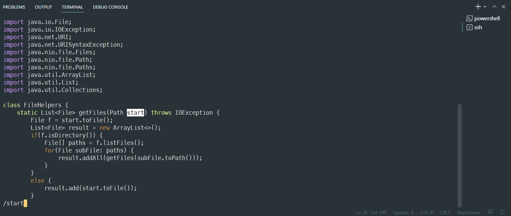
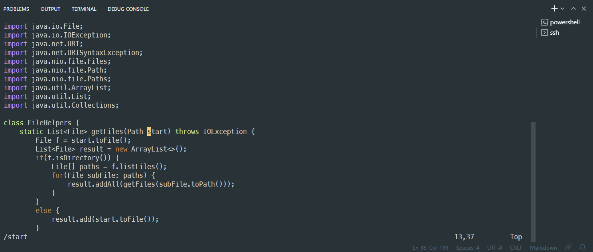
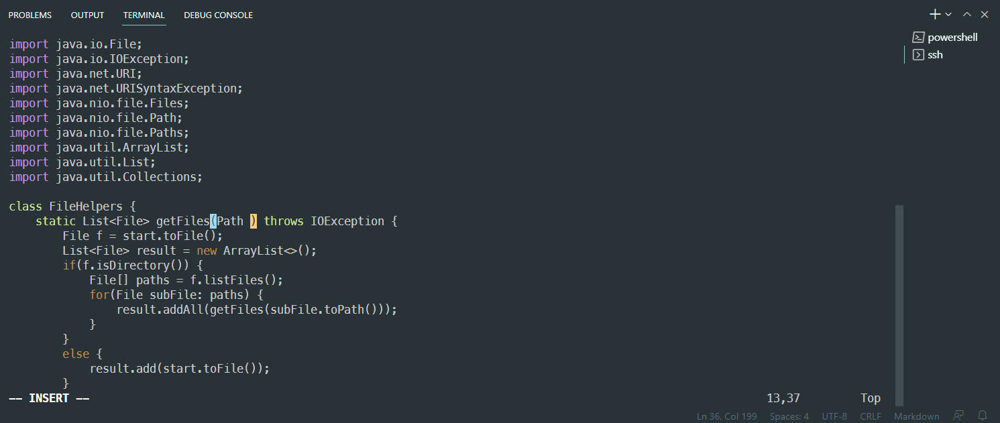
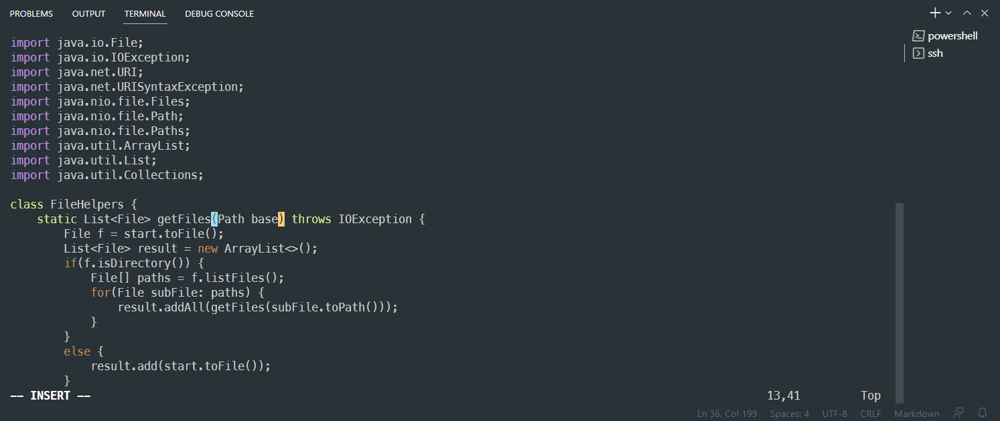
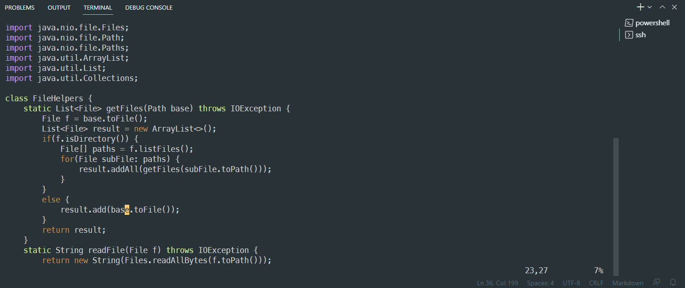
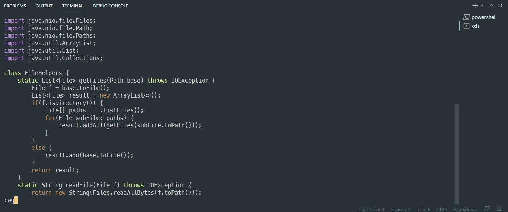

# __Lab Report 4 (Week 7)__

## __Part1__ : Changing the name of the __start__ parameter and its uses to __base__

Step 1 : Login to the Remote Server

Step 2 : `cd week6-skill-demo1`

Step 3 : `vim DocSearchServer.java`

Step 4 : Performing the task (Total 22 Keys Pressed)

1) Type `/start` (Six Keys Pressed) : By typing `/start`, it will highlight the word "start".

2) Press `Enter` Key (One Key Pressed) : By pressing Enter, the first character of the word will be highlighted.

3) Type `c` and `e` (Two Keys Pressed): The word "start" will be deleted

4) Type `base` (Four Keys Pressed) : Replacing the word

5) Press `ESC` Key (One Key Pressed): Escaping from the insert mode

6) Type `n` `.` `n` `.` (Four Keys Pressed): Replacing start to base

7) Type `:wq` and Press the `Enter` Key (Four Keys Pressed) : Saves the change and finishs the vim mode.

## __Part2__ : Questions

First Style : 40 seconds

Second Style : 36 seconds

Q1) Which of these two styles would you prefer using if you had to work on a program that you were running remotely, and why?

- I would prefer working with the "Second Style", if I am running remotely. It is more efficient to use the "Second Style" because I can save key strokes comparing with the "First Style". For example, if I use the "First Style", I would be using `scp` command and changing the server between local and remote a lot. By using the "Second Style", I don't need to use the `scp` command and change my server between local and remote.

Q2) What about the project or task might factor into your decision one way or another?

- If the project could be worked in the local server, I will prefer the "First Style". Right now, I feel confidence writing and editing codes based on my keyboard settings. I still need to get used to using the "Second Style".

- However, if the program should be worked on the remote machine, then I will pick the "Second Style" because it will be more convenient working on the remote machine. Also, if I get used to the "Second Style", I will use the "Second Style". Since, it saves key strokes compared to the "First Style".