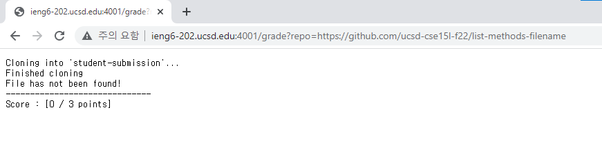
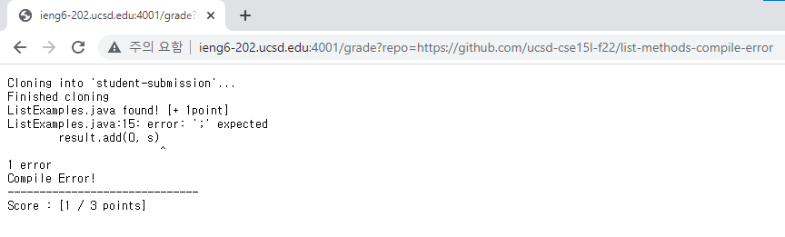
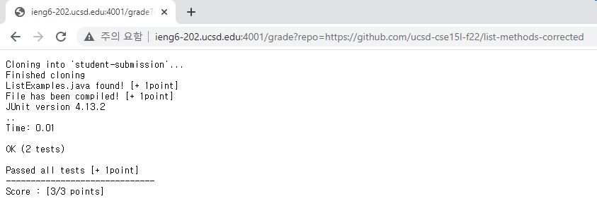

# __Lab Report5 (Week 9)__

## _`grade.sh`_

```
rm -rf student-submission
git clone $1 student-submission
echo "Finished cloning"

cd student-submission
Score=0

if [[ ! -f ListExamples.java ]]
then 
    echo "File has not been found!"
    echo "------------------------------"
    echo "Score : [$Score / 3 points]"
    exit 1

else 
   echo "ListExamples.java found! [+ 1point]"
   ((Score+=1))
fi

cd ..
cp TestListExamples.java student-submission/
cp -r lib student-submission/
cd student-submission/
javac -cp .:../lib/hamcrest-core-1.3.jar:../lib/junit-4.13.2.jar *.java

if [[ $? -ne 0 ]]
then
  echo "Compile Error!"
  echo "------------------------------"
  echo "Score : [$Score / 3 points]"
  exit 1

else
   echo "File has been compiled! [+ 1point]"
   ((Score+=1))
fi

java -cp .:../lib/hamcrest-core-1.3.jar:../lib/junit-4.13.2.jar org.junit.runner.JUnitCore TestListExamples

if [[ $? -ne 0 ]]
then
  echo "Failed tests"
  echo "------------------------------"
  echo "Score : [$Score / 3 points]"
  exit 1
else
  echo "Passed all tests [+ 1point]"
  ((Score+=1))
  echo "------------------------------"
  echo "Score : [$Score/3 points]"
  exit 0
fi
```

## _Three Screenshot_








## _Tracing Script (https://github.com/ucsd-cse15l-f22/list-methods-compile-error)_

`Line 1` Return Code : 0

`Line 2` Return Code : 0

`Line 3` Return Code : 0

`Line 5` Return Code : 0

`Line 20` Return Code : 0

`Line 21` Return Code : 0

`Line 22` Return Code : 0

`Line 23` Return Code : 0

`Line 24` Return Code : 1 (Standard Error)

```
ListExamples.java:15: error: ';' expected              
          result.add(0, s)
                               ^                    
1 error
```
`Line 28,29,30` Standard Output

```
Compile Error!
------------------------------
Score : [1 / 3 points]
```

`if statements`

`Line 8` : The "if statement" is true because the ListExamples.java file was found in the repository. Also it was added to the directory for submission.

`Line 26` : The "if statement" is true because the ListExamples.java file had a compile error. Also, the return code is not 0.

`Line 40` : The third "if statement" could not be ran because the bash script will exit as the file has a compile error.

Line 33 ~ 52 didn't run because of the second "if statement".

