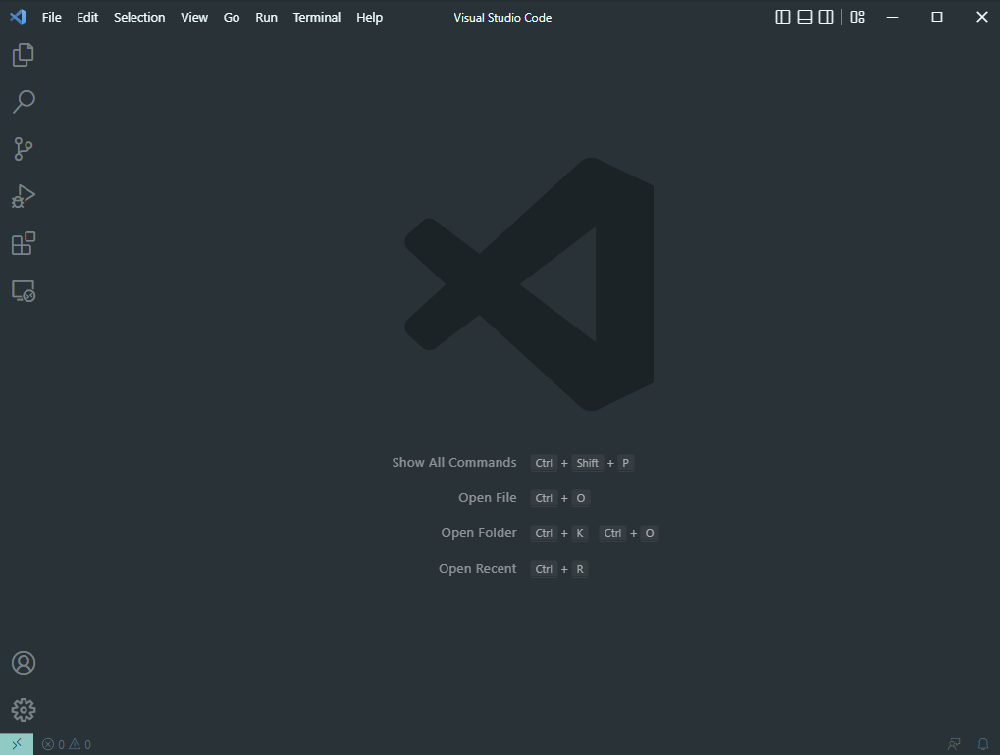

# __Tutorial__

Hello, everyone! This will be a tutorial for you to learn how to log into a course-specific account on ieng6. I hope this tutorial will help you!

 1. __Installing VScode__

    - We need to install Visual Studio Code. You can download it from this website link. Be sure to download the right version for you operating system (Windows, OS, etc). [https://code.visualstudio.com/](https://code.visualstudio.com/)

     

2. __Remotely Connecting__

    - Setting up the course specific account
    - If you are a Windows user, you should download OpenSSH (Follow the link!) 

3. __Trying Some Commands__

    Now, let's try some commands!
    
    First, try to work with these commands. `cd`, `ls`, `pwd`, `mkdir`, and `cp` 

    - `cd ~`
    - `cd`
    - `ls -lat`
    - `ls -a`
    - `ls <directory>` where <directory> is /home/linux/ieng6/cs15lfa22/cs15lfa22abc, where the abc is one of the other group members’ username
    - `cp /home/linux/ieng6/cs15lfa22/public/hello.txt ~/`
    - `cat /home/linux/ieng6/cs15lfa22/public/hello.txt`

    To log out from the remote server in your terminal, you can try:
4. __Moving Files with scp__

    - 
5. __Setting an SSH Key__
6. __Optimizing Remote Running__