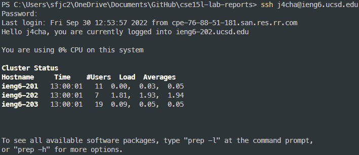
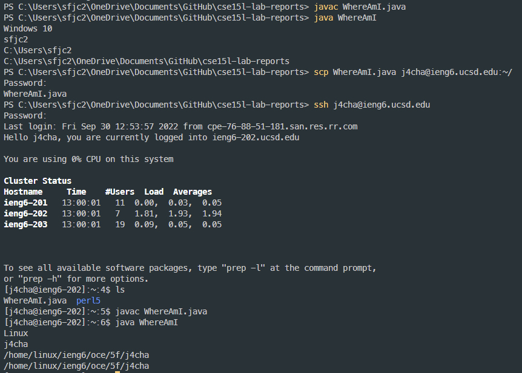
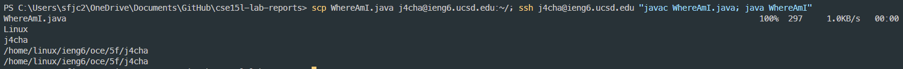

# __Tutorial__

Hello, everyone! This will be a tutorial for you to learn how to log into a course-specific account on ieng6. I hope this tutorial will help you!

 1. __Installing VScode__

     We need to install Visual Studio Code. You can download it from this website link. Be sure to download the right version for you operating system (Windows, OS, etc). [https://code.visualstudio.com/](https://code.visualstudio.com/)

    - If you finish the download and open Visual Studio Code, it will look somewhat like the picture below. (Colors might be different!)
    
         

2. __Remotely Connecting__

    Setting up the course specific account
    - If you are a Windows user, you should download OpenSSH (Follow the link!) [https://learn.microsoft.com/en-us/windows-server/administration/openssh/openssh_install_firstuse?tabs=gui](https://learn.microsoft.com/en-us/windows-server/administration/openssh/openssh_install_firstuse?tabs=gui)
    - Only download the OpenSSH __client__. Do not download the server.
    - For the first step, type the command in your terminal and type in your password.
    ``` 
     $ ssh cs15lfa22zz@ieng6.ucsd.edu 
    ```
    - If you can't connect this account, you can use your own account! (I did it by this way!)
    ``` 
     $ ssh <Your-UCSDgmail-ID>@ieng6.ucsd.edu 
    ```

    

    - I previously logged in before, so the text might be little different. 

    -  If the terminal shows you, "The authenticity of host 'ieng6.ucsd.edu (128.54.70.227)' can't...", type yes.


3. __Trying Some Commands__

    Now, let's try some commands!
    
    First, try to work with these commands. `cd`, `ls`, `pwd`, `mkdir`, and `cp`

    Now, try to work with these commands too! 

    - `cd ~`
    - `cd`
    - `ls -lat`
    - `ls -a`
    - `ls <directory>` where <directory> is /home/linux/ieng6/cs15lfa22/cs15lfa22abc, where the abc is one of the other group members’ username
    - `cp /home/linux/ieng6/cs15lfa22/public/hello.txt ~/`
    - `cat /home/linux/ieng6/cs15lfa22/public/hello.txt`

    For logging out from the remote server in your terminal, you can try: command "exit" or press Ctrl + D

    

4. __Moving Files with scp__

    - Now, let's connect to the remote server with using ssh and a new command called scp.

    - First, make a new file in VS Code named WhereAmI.java. Then, put the following content below.
    ```
    class WhereAmI {
        public static void main(String[] args) {
            System.out.println(System.getProperty("os.name"));
            System.out.println(System.getProperty("user.name"));
            System.out.println(System.getProperty("user.home"));
            System.out.println(System.getProperty("user.dir"));
        }
    } 
    ```

    - Now, let's compile and run the file on the client.

    - Next, run this command!
    
    ```
    scp WhereAmI.java <user-name>@ieng6.ucsd.edu:~/
    ```

    - Log into ieng6 using again ssh again! Afterthat use command _s. You will be now able to see the file in the home directory!

    -  

5. __Setting an SSH Key__

    - In the terminal, type in "ssh-keygen" and press enter to create a public and private SSH keys. Type 'y', if it ask "Overwrite (y/n)?". Also, leave the input blank for the passphrase.

    - Now, at the back of the command _scp_ add the command below! (Only one _scp_ command)

    ```
    scp <default path>/.ssh/id_rsa.pub <username>@ieng6.ucsd.edu:~/.ssh authorized_keys
    ```

    - For Windows users, Default path should look like C:\User\... 

- Here is the Screenshot that how it will look!
    

    - Also, if you're a Windows user, follow the instructions for ssh-add under "User key generation". [https://docs.microsoft.com/en-us/windows-server/administration/openssh/openssh_keymanagement#user-key-generation](https://docs.microsoft.com/en-us/windows-server/administration/openssh/openssh_keymanagement#user-key-generation)

    

    - Once you finished this process, you don't need to type your password anymore! 

6. __Optimizing Remote Running__

    - By using semicolon(;), commands can be connected in one line!
    ```
    cp WhereAmI.java OtherMain.java; javac OtherMain.java; java WhereAmI
    ```

    - Commands are abled to run on the server when they are connected with ssh.
    ```
    ssh (username)@ieng6.ucsd.edu "javac (Filename.java); java (Filename)".
    ```

    

    - By using the 'up-arrow', you could recall the last command that was ran.

    - Personally, I was able to save couple of keystrokes and time connecting the commands in one line! Using up-arrow key will be a method to save your keystrokes.